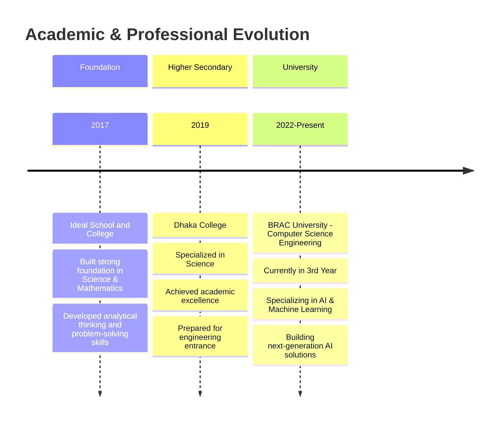

# 🚀 MAH Rahat | Aspiring AI Engineer focused on Computer vision 🖥️

<div align="center">
  
  

  [  
  ](https://git.io/typing-svg)

  
  
  
  
  

</div>

---

## 🎯 About Me

<table>
<tr>
<td width="60%">

```python
class MAH_Rahat:
    def __init__(self):
        self.name = "MAH Rahat"
        self.role = " Currently mastering Data Science on a path to advanced Machine Learning 🤖"
        self.location = "Dhaka, Bangladesh 🇧🇩"
        self.education = {
            "current": "BRAC University - CSE (3rd Year)",
            "college": "Dhaka College",
            "school": "Ideal School and College"
        }
        self.specializations = [
            "🤖 Artificial Intelligence & Machine Learning",
            "👁️ Computer Vision & Image Processing", 
            "🌐 Full-Stack Web Development",
            "🎨 UI/UX Design & Digital Marketing",
            "📊 Data Science & Business Analytics"
        ]
        self.current_mission = "Building AI solutions that matter"
        self.vision = "Creating technology that transforms lives"
        
    def get_superpowers(self):
        return [
            "🧠 Deep Learning Architecture Design",
            "🔍 Real-time Computer Vision Systems",
            "⚡ Full-Stack Development (React to AI APIs)",
            "🎨 Creative Problem Solving",
            "📈 Business Strategy & Growth Hacking"
        ]
        
    def say_hi(self):
        print("Welcome to my digital universe! 🌟")
        print("Let's build the future with AI together! 🚀")

developer = MAH_Rahat()
developer.say_hi()
```

</td>


### 🌟 **Quick Stats**
- 🎓 **Computer Science Engineer** (3rd Year)
- 🏢 **5+ Years** Professional Experience
- 🎨 **Multi-disciplinary** Background
- 🚀 **AI Enthusiast** & **Tech Innovator**
- 🌍 **Global Mindset** with **Local Impact**

### 🎯 **Currently Exploring**
- 🔬 Advanced Neural Networks
- 👁️ Computer Vision Applications
- 🤖 MLOps & Production AI
- 🌐 AI-Powered Web Applications

### ⚡ **Fun Facts**
- 🎨 Started as a **Graphic Designer**
- 💼 Evolved into **Business Strategist**
- 💻 Now **Full-Stack AI Developer**
- 🎵 Code better with **Lo-fi Hip Hop**


</tr>
</table>

---

## 🎓 Academic Journey

<div align="center">

### 📚 **Educational Excellence**

</div>



<table align="center">
<tr>
<td align="center">

<br><sub><b>Strong Mathematical & Scientific Foundation</b></sub>
</td>
<td align="center">

<br><sub><b>Academic Excellence in Science</b></sub>
</td>
<td align="center">

<br><sub><b>Specializing in AI & Machine Learning</b></sub>
</td>
</tr>
</table>

---

## 💼 Professional Experience

<div align="center">

### 🚀 **Career Evolution Timeline**

</div>

<details>
<summary><b>🎨 Design & Creative Era (2020-2023)</b></summary>

<table>
<tr>
<td width="20%"><strong>2020</strong></td>
<td width="30%"><strong>Nerv System BD</strong></td>
<td width="25%"><strong>Project Debug Specialist</strong></td>
<td width="25%">🔧 Technical problem-solving<br>🎯 System optimization</td>
</tr>
<tr>
<td><strong>2021</strong></td>
<td><strong>Chaaway</strong></td>
<td><strong>Graphic Designer</strong></td>
<td>🎨 Visual design<br>🖼️ Brand development</td>
</tr>
<tr>
<td><strong>2022-2023</strong></td>
<td><strong>Multiple Companies</strong></td>
<td><strong>Senior Graphic Designer</strong></td>
<td>🌟 <strong>Diggger, Chillox, Skillshikhun</strong><br>🚀 <strong>North South Startup Next</strong><br>📈 Design leadership & innovation</td>
</tr>
</table>

</details>

<details>
<summary><b>💼 Business & Sales Excellence (2023-2024)</b></summary>

<table>
<tr>
<td width="20%"><strong>2023</strong></td>
<td width="30%"><strong>Aarong</strong></td>
<td width="25%"><strong>Sales Executive</strong></td>
<td width="25%">💰 Revenue generation<br>🤝 Customer relations<br>📊 Sales strategy</td>
</tr>
<tr>
<td><strong>2024</strong></td>
<td><strong>Digital Marketing</strong></td>
<td><strong>Marketing Specialist</strong></td>
<td>🌐 <strong>Stylescape & Bilipotro</strong><br>📈 Campaign management<br>🎯 Brand enhancement<br>💡 Growth hacking</td>
</tr>
</table>

</details>

<details>
<summary><b>💻 Tech Development Era (2025-Present)</b></summary>

<table>
<tr>
<td width="20%"><strong>2025</strong></td>
<td width="30%"><strong>Frontend Development</strong></td>
<td width="25%"><strong>Full-Stack Developer</strong></td>
<td width="25%">⚛️ React.js mastery<br>🎨 UI/UX excellence<br>🤖 AI integration<br>🚀 Modern web apps</td>
</tr>
</table>

</details>

<div align="center">

### 🏆 **Professional Highlights**


</div>

---

## 🛠️ Tech Arsenal & Skills

<div align="center">

### 🎯 **Full-Stack AI Engineer Toolkit**

</div>

<details>
<summary><b>🤖 AI & Machine Learning Mastery</b></summary>
<br>

<div align="center">


</div>

**🎯 Specializations:**
- 🧠 **Deep Learning:** Neural Networks, CNNs, RNNs, Transformers
- 👁️ **Computer Vision:** Image Processing, Object Detection, Face Recognition
- 📊 **Data Science:** Statistical Analysis, Predictive Modeling, Data Mining
- 🤖 **MLOps:** Model Deployment, CI/CD Pipelines, Production Monitoring

</details>

<details>
<summary><b>🌐 Full-Stack Development Excellence</b></summary>
<br>

<div align="center">

**Frontend Technologies**


**Backend & APIs**


</div>

</details>

<details>
<summary><b>🗄️ Database & Cloud Technologies</b></summary>
<br>

<div align="center">


</div>

</details>

<details>
<summary><b>🎨 Design & Creative Tools</b></summary>
<br>

<div align="center">


</div>

**🎨 Design Expertise:**
- 🖼️ **Visual Design:** Brand Identity, Logo Design, Marketing Materials
- 🌐 **UI/UX Design:** User Interface, User Experience, Prototyping
- 📱 **Digital Marketing:** Social Media Graphics, Campaign Design
- 🎥 **Multimedia:** Video Editing, Animation, Interactive Design

</details>

---

## 🏆 Featured Projects & Portfolio

<div align="center">

### 🌟 **Innovation Showcase**

</div>

<table>
<tr>
<td width="50%">

### 🤖 **AI & Machine Learning**
<div align="center">


</div>

- 🧠 **Neural Network Implementations**
- 👁️ **Computer Vision Applications** 
- 📊 **Data Science Pipelines**
- 🔍 **Predictive Analytics Tools**

🚧 *Revolutionary AI solutions in active development*

**Technologies:** Python, TensorFlow, OpenCV, Scikit-learn

</td>
<td width="50%">

### 🌐 **Full-Stack Applications**
<div align="center">


</div>

- ⚛️ **React.js Web Applications**
- 🎨 **Interactive UI/UX Designs**
- 🔗 **API Development & Integration**
- 📱 **Responsive Design Systems**

🚧 *Modern web applications with AI integration*

**Technologies:** React, Node.js, Express, MongoDB

</td>
</tr>
<tr>
<td width="50%">

### 🎨 **Design & Creative Works**
<div align="center">


</div>

- 🏢 **Brand Identity Systems**
- 📈 **Marketing Campaign Designs**
- 🖼️ **Digital Art & Illustrations**
- 📱 **UI/UX Design Projects**

✨ *Award-winning designs across multiple industries*

**Tools:** Photoshop, Illustrator, Figma, Canva

</td>
<td width="50%">

### 📊 **Business & Analytics**
<div align="center">


</div>

- 📈 **Sales Growth Strategies**
- 🎯 **Digital Marketing Campaigns**
- 💡 **Business Process Optimization**
- 📊 **Data-Driven Decision Making**

🚀 *Proven track record of business success*

**Focus:** Strategy, Analytics, Growth Hacking

</td>
</tr>
</table>

<div align="center">

[](https://github.com/mah-rahat?tab=repositories)

</div>

---

## 📈 GitHub Analytics & Achievements

<div align="center">

### 🎯 **Performance Dashboard**

<table>
<tr>
<td width="50%">


</td>
<td width="50%">


</td>
</tr>
<tr>
<td colspan="2" align="center">


</td>
</tr>
</table>

### 🏆 **Achievement Gallery**

[](https://github.com/ryo-ma/github-profile-trophy)

### 📊 **Contribution Visualization**

[](https://github.com/ashutosh00710/github-readme-activity-graph)

### ⚡ **Coding Activity**

[](https://github.com/anuraghazra/github-readme-stats)

</div>

---

## 🎯 Vision & Mission

<div align="center">

### 🚀 **Transforming the Future with AI**

</div>

<table>
<tr>
<td width="50%">

### 🎯 **Current Focus**
- 🔬 **AI Research:** Deep Learning & Computer Vision
- 🛠️ **Product Development:** AI-powered applications
- 📚 **Continuous Learning:** Cutting-edge technologies
- 🌍 **Global Impact:** Solutions that matter

### 💡 **Innovation Areas**
- 🤖 **Intelligent Automation**
- 👁️ **Real-time Computer Vision**
- 🧠 **Neural Network Optimization**
- 🌐 **AI-Web Integration**

</td>
<td width="50%">

### 🌟 **Professional Goals**
- 🎓 **Academic Excellence:** Top-tier CSE graduate
- 🏢 **Industry Leadership:** AI engineering expertise
- 🚀 **Entrepreneurship:** Tech startup founding
- 🌍 **Social Impact:** Technology for good

### 🔮 **Future Vision**
- 🤖 **AI Democratization:** Making AI accessible
- 🌐 **Global Solutions:** Solving world problems
- 🎓 **Education:** Teaching next generation
- 💡 **Innovation:** Breakthrough discoveries

</td>
</tr>
</table>

---

## 🌐 Connect & Collaborate

<div align="center">

### 💬 **Let's Build Something Amazing Together!**

[](https://linkedin.com/in/ah-rahat)
[](https://twitter.com/mah_rahat)
[](https://www.youtube.com/c/@quantacraft_ai)
[](https://instagram.com/indigoecliptic)
[](https://fb.com/mah.rahat)
[](https://discord.gg/0260)

### 📧 **Professional Contact**
[](mailto:your-email@example.com)
[](https://mah-rahat.github.io)
[](https://drive.google.com/your-resume)

### 🏅 **Coding & Competitive Programming**
[](https://www.leetcode.com/ah-rahat)
[](https://kaggle.com/ah-rahat)
[](https://codechef.com/users/ah-rahat)
[](https://codeforces.com/profile/ah-rahat)

</div>

---

## 🎵 Current Vibes & Inspiration

<div align="center">

### 🎧 **Coding Soundtrack**

[](https://spotify-github-profile.vercel.app/api/spotify-playing)

### 💭 **Latest Thoughts & Insights**

</div>

<!-- BLOG-POST-LIST:START -->
- 🧠 [The Mathematics Behind Neural Networks: A Deep Dive](https://your-blog.com/neural-networks-math)
- 👁️ [Real-time Computer Vision: From Theory to Production](https://your-blog.com/cv-production)
- 🚀 [My Journey: From Graphic Designer to AI Engineer](https://your-blog.com/career-transformation)
- 📊 [Building Scalable ML Pipelines: Lessons Learned](https://your-blog.com/ml-pipelines)
- 🌐 [The Future of AI in Web Development](https://your-blog.com/ai-web-development)
<!-- BLOG-POST-LIST:END -->

---

## 🏆 Achievements & Recognition

<div align="center">

<table>
<tr>
<td align="center">

<br><sub><b>Consistent Academic Excellence</b></sub>
</td>
<td align="center">

<br><sub><b>Multi-Industry Experience</b></sub>
</td>
<td align="center">

<br><sub><b>Design Excellence Recognition</b></sub>
</td>
</tr>
<tr>
<td align="center">

<br><sub><b>Proven Sales & Marketing Success</b></sub>
</td>
<td align="center">

<br><sub><b>Cutting-edge AI Development</b></sub>
</td>
<td align="center">

<br><sub><b>Technology for Social Good</b></sub>
</td>
</tr>
</table>

</div>

---

<div align="center">

### 🌟 **"From Pixels to Intelligence, From Ideas to Impact"**

*Transforming creative vision into intelligent solutions, one algorithm at a time.*


⭐ **Star my repositories if they inspire you!** | 🤝 **Let's collaborate and build the future!**

</div>

---

<div align="center">
<i>
🎯 <b>Mission:</b> Building AI solutions that make a difference<br>
💡 <b>Vision:</b> A world where technology serves humanity<br>
🚀 <b>Goal:</b> Leading the next generation of AI innovation<br>
</i>
</div>
